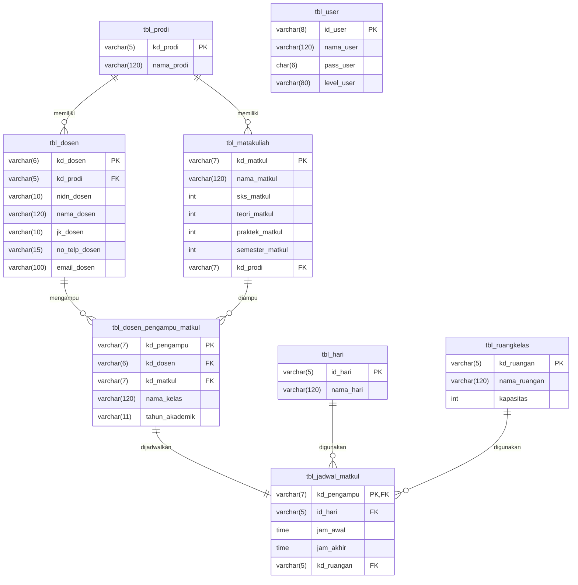

# APK Penjadwalan Matakuliah TRPL OOP

Aplikasi desktop Windows untuk manajemen penjadwalan matakuliah di Program Studi Teknologi Rekayasa Perangkat Lunak (TRPL), Politeknik Enjinering Indorama.

## 🎯 Fitur Utama

- **Data Master** - Kelola data Dosen, Matakuliah, Program Studi, Ruang Kelas, Hari, dan User
- **Transaksi** - Input dosen pengampu matakuliah dan penjadwalan kuliah
- **Laporan** - Cetak laporan data dosen, matakuliah, pengampu, dan jadwal kuliah
- **Deteksi Bentrok** - Otomatis mendeteksi konflik jadwal ruangan dan dosen

## 🛠️ Teknologi

| Komponen | Teknologi |
|----------|-----------|
| Bahasa | Visual Basic .NET |
| Framework | .NET Framework 4.8 |
| Database | MySQL |
| Report | Crystal Reports |
| IDE | Visual Studio 2019 |

## 📁 Struktur Proyek

```
APK_Penjadwalan_Matakuliah_TRPL_OOP/
├── Entities/          # Domain models dengan validasi
│   ├── Base/          # Abstract base class
│   └── Interfaces/    # Interface definitions
├── Forms/             # Windows Forms UI
│   ├── Master/        # Form data master
│   ├── Transaksi/     # Form transaksi
│   ├── Laporan/       # Form cetak laporan
│   └── Sistem/        # Form sistem (Login, Menu)
├── Modules/           # Helper modules
├── Repositories/      # Data access layer
├── Reports/           # Crystal Reports (.rpt)
└── Resources/         # Icons dan gambar
```

## 🚀 Panduan Instalasi

### 📋 Prasyarat Sistem
- **Visual Studio 2019** (Workload: .NET Desktop Development)
- **MySQL Server 8.0** atau MariaDB
- **Crystal Reports Runtime** (sesuai versi Visual Studio)
- **MySQL Connector/NET**

### 🛠️ Langkah Pengaturan

1.  **Clone Repository**
    ```bash
    git clone https://github.com/CallMeJaja/APK_Penjadwalan_Matakuliah_TRPL_OOP.git
    ```
2.  **Persiapkan Database**
    - Buat database baru bernama `db_penjadwalan` di MySQL.
    - Import file SQL yang tersedia di folder `Database/db_penjadwalan.sql` (atau file terbaru).
3.  **Konfigurasi Koneksi**
    - Buka solusi `.sln` di Visual Studio 2019.
    - Edit `App.config` dan sesuaikan value pada `DbConnectionString`:
    ```xml
    <setting name="DbConnectionString" serializeAs="String">
        <value>server=localhost;user id=root;password=;database=db_penjadwalan;port=3306</value>
    </setting>
    ```
4.  **Restore & Build**
    - Pastikan semua referensi library terpanggil.
    - Build Solution (Ctrl+Shift+B).
    - Jalankan aplikasi (F5).

## 📖 Arsitektur

Aplikasi ini menggunakan arsitektur **OOP (Object-Oriented Programming)** dengan pola:

- **Entity Pattern** - Domain models dengan built-in validation
- **Repository Pattern** - Abstraksi akses database
- **Base Form Pattern** - Reusable form components
- **Module Pattern** - Utility functions terpisah

## 👤 Default Login

| Username | Password | Level |
|----------|----------|-------|
| Admin | @123 | Administrator |

## 📊 Skema Database

### Entity Relationship Diagram (ERD)



### Kamus Data (Data Dictionary)

#### 1. Data Master

**Tabel: `tbl_prodi` (Program Studi)**
| Field | Type | Constraint | Deskripsi |
|-------|------|------------|-----------|
| `kd_prodi` | varchar(5) | PK | Kode unik program studi |
| `nama_prodi` | varchar(120) | Unique | Nama program studi |

**Tabel: `tbl_dosen` (Dosen)**
| Field | Type | Constraint | Deskripsi |
|-------|------|------------|-----------|
| `kd_dosen` | varchar(6) | PK | Kode unik dosen |
| `kd_prodi` | varchar(5) | FK | Referensi ke `tbl_prodi` |
| `nidn_dosen` | varchar(10) | Unique | NIDN dosen |
| `nama_dosen` | varchar(120) | Unique | Nama lengkap dosen |
| `jk_dosen` | varchar(10) | - | Jenis kelamin (LAKI-LAKI/PEREMPUAN) |
| `no_telp_dosen`| varchar(15) | Unique | Nomor telepon dosen |
| `email_dosen` | varchar(100) | Unique | Alamat email resmi dosen |

**Tabel: `tbl_matakuliah` (Mata Kuliah)**
| Field | Type | Constraint | Deskripsi |
|-------|------|------------|-----------|
| `kd_matkul` | varchar(7) | PK | Kode unik mata kuliah |
| `nama_matkul` | varchar(120) | Unique | Nama mata kuliah |
| `sks_matkul` | int | - | Total bobot SKS |
| `teori_matkul` | int | - | Beban SKS teori |
| `praktek_matkul`| int | - | Beban SKS praktek |
| `semester_matkul`| int | - | Penempatan semester |
| `kd_prodi` | varchar(7) | FK | Referensi ke `tbl_prodi` |

**Tabel: `tbl_hari` (Hari)**
| Field | Type | Constraint | Deskripsi |
|-------|------|------------|-----------|
| `id_hari` | varchar(5) | PK | Kode unik hari |
| `nama_hari` | varchar(120) | Unique | Nama hari (SENIN-JUMAT) |

**Tabel: `tbl_ruangkelas` (Ruang Kelas)**
| Field | Type | Constraint | Deskripsi |
|-------|------|------------|-----------|
| `kd_ruangan` | varchar(5) | PK | Kode unik ruangan |
| `nama_ruangan` | varchar(120) | Unique | Nama/Nomor ruangan |
| `kapasitas` | int | - | Kapasitas tampung mahasiswa |

#### 2. Data Transaksi

**Tabel: `tbl_dosen_pengampu_matkul` (Penempatan Dosen)**
| Field | Type | Constraint | Deskripsi |
|-------|------|------------|-----------|
| `kd_pengampu` | varchar(7) | PK | Kode unik relasi (PMKXXXX) |
| `kd_dosen` | varchar(6) | FK | Referensi ke `tbl_dosen` |
| `kd_matkul` | varchar(7) | FK | Referensi ke `tbl_matakuliah` |
| `nama_kelas` | varchar(120) | - | Nama kelas (e.g. Reguler) |
| `tahun_akademik`| varchar(11) | - | Format "YYYY/YYYY" |

**Tabel: `tbl_jadwal_matkul` (Jadwal Perkuliahan)**
| Field | Type | Constraint | Deskripsi |
|-------|------|------------|-----------|
| `kd_pengampu` | varchar(7) | PK, FK | Link ke `tbl_dosen_pengampu_matkul`|
| `id_hari` | varchar(5) | FK | Link ke `tbl_hari` |
| `jam_awal` | time | - | Waktu mulai kuliah |
| `jam_akhir` | time | - | Waktu selesai kuliah |
| `kd_ruangan` | varchar(5) | FK | Link ke `tbl_ruangkelas` |

#### 3. Data Sistem

**Tabel: `tbl_user` (Pengguna)**
| Field | Type | Constraint | Deskripsi |
|-------|------|------------|-----------|
| `id_user` | varchar(8) | PK | ID unik pengguna |
| `nama_user` | varchar(120) | Unique | Username login |
| `pass_user` | char(6) | - | Password login |
| `level_user` | varchar(80) | - | Role (Administrator/Mahasiswa) |

### Database Views

Aplikasi menggunakan SQL Views untuk optimasi laporan:

1.  **`vw_jadwal_cetak`**
    Menggabungkan seluruh informasi penjadwalan (matkul, dosen, hari, jam, ruang) untuk tampilan laporan cetak.
2.  **`vw_plotting_dosen`**
    Digunakan untuk memantau beban mengajar dosen berdasarkan matakuliah dan kelas yang diampu.

## 👥 Kelompok 4

| Nama | NIM |
|------|-----|
| **Intan Sri Dayanti** | 202404007 |
| **Muhamad Gilang Ramadan** | 202404008 |
| **Reza Asriano Maulana** | 202404021 |
| **Zahra Ayu Trisna** | 202404019 |

## 📄 Lisensi

Proyek ini dibuat untuk keperluan akademik di Politeknik Enjinering Indorama.

---
*Dikembangkan dengan ❤️ menggunakan VB.NET*
